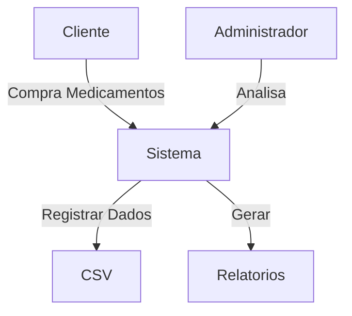

# Pharma-data-manager

**Disciplina:** Programação para Ciência de Dados  
**Curso:** MBA Ciência de Dados - UNIFOR  
**Instrutor:** Cássio Pinheiro

**Integrantes:**  
- Pedro Vitor Silva França (2527746)

**Repositório GitHub:** [(https://github.com/devpedrovitor/pharma-data-manager.git)](https://github.com/devpedrovitor/pharma-data-manager.git) 

**Data de Entrega:** 14/11/2024

## 1. Objetivo do Projeto
Desenvolver um sistema em Python para gerenciar e analisar dados de uma farmácia, com foco em:
- Controle de estoque
- Análise de vendas
- Detecção de produtos com estoque baixo
- Visualizações e relatórios automáticos

## 2. Diagrama de Contexto


## 3. Funcionalidades Implementadas
- Leitura e escrita de arquivos CSV
- Limpeza de dados (remover duplicatas, preencher nulos, coerção de datas)
- Estatísticas básicas (total de vendas, média de preços)
- Identificação de produtos com baixo estoque
- Visualizações: top produtos, distribuição de preços, mapa de correlação
- Geração de relatório em texto e imagens

## 4. Estrutura de Dados
Os dados ficam na pasta `data/` no formato CSV. Colunas esperadas:
- produto, categoria, quantidade_estoque, preco, unidades_vendidas, validade, fornecedor, estoque_minimo

## 5. Requisitos Técnicos
- Python 3.10+ recomendado
- Bibliotecas:
  - pandas
  - numpy
  - matplotlib
  - seaborn
  - termcolor

Instalação:
```
pip install -r requirements.txt
```

## 6. Como Executar
1. Coloque seu CSV em `data/` (ex.: `data/pharmacy_data_dirty.csv`)
2. Execute:
```
python main.py
```
3. Os resultados serão gerados em `data/pharmacy_data_clean.csv` e em `relatorios/` (imagens e `relatorio.txt`)

## 7. Análises Realizadas
- Cálculo do total de unidades vendidas
- Média de preços
- Identificação de produtos abaixo do estoque mínimo
- Top N produtos por vendas

## 8. Estrutura do Projeto
```
pharma-data-manager/
├── README.md
├── requirements.txt
├── main.py
├── data/
│   └── pharmacy_data_dirty.csv
│   └── stock_pharmacy.csv
├── src/
│   ├── data_cleaner.py
│   ├── data_loader.py
│   ├── analysis.py
│   ├── plots.py
│   └── reports.py
├── relatorios/
└── .venv/
```

## 9. Testes Realizados
- Teste com arquivo `data/stock_pharmacy.csv`
- Teste com arquivo sujo `pharmacy_data_dirty.csv` e com datas inválidas

## 10. Contribuições
- Pedro Vitor Silva França (2527746): implementação, documentação e análise

## 11. Próximos Passos
- Gerar um notebook com análise exploratória
- Criar interface web simples (Flask/FastAPI)
- Melhorar tratamento de erros e testes automatizados
